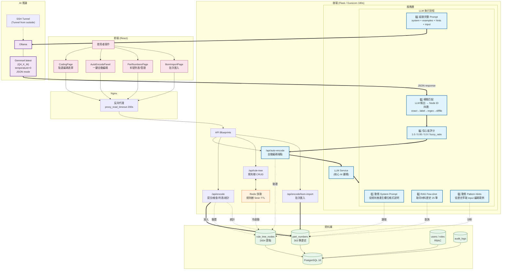

# ERP 自動編碼系統 (ERP Auto-Coding System)

這是一個現代化的企業級 ERP 自動編碼系統，具備嚴謹的 RBAC 權限控管與 Admin-Approved 註冊審核機制。系統核心透過最佳化的資料庫結構儲存多版本的「編碼規則樹」，並預留 LLM 與 RAG 技術介面，以實現依據料號特徵自動生成 16 碼企業料號的智能編碼功能。

## 技術棧 (Tech Stack)

### 前端 (Frontend)

| 類別 | 技術 |
|---|---|
| 框架 | React 19 + TypeScript |
| 建置工具 | Vite 8 |
| 樣式框架 | Tailwind CSS v4 |
| 編譯最佳化 | Babel Plugin React Compiler |
| 路由 | React Router v7 |
| HTTP Client | Axios |
| 套件管理 | pnpm |

### 後端 (Backend)

| 類別 | 技術 |
|---|---|
| 語言 | Python 3.14 |
| 框架 | Flask 3 |
| 套件管理 | uv |
| 認證 | JWT (PyJWT) |
| 密碼雜湊 | Argon2 |
| ORM | SQLAlchemy + Flask-SQLAlchemy |
| 資料庫遷移 | Flask-Migrate |
| 速率限制 | Flask-Limiter |
| 序列化 | Marshmallow |

### AI 與基礎設施

| 類別 | 技術 |
|---|---|
| 主資料庫 | PostgreSQL 16 |
| 快取與限流 | Redis 7 |
| LLM | Ollama + Gemma4:latest (8B Q4_K_M) |
| LLM API | 自訂 Ollama 端點 (env: `OLLAMA_BASE_URL`) |
| 容器化 | Docker, Docker Compose |
| 版本控制 | Git, GitHub |

## 核心功能模組

1. **封閉式認證與授權 (Closed System Auth)** ✅ *已完成*
   - Admin-Approved 註冊機制: pending → admin 審批 → active
   - JWT 登入 (access_token 15min + refresh_token 7天)
   - RBAC 權限控管 (Admin / RuleMaker / User 角色)
   - 離線忘記密碼: admin 發臨時密碼 → 強制修改密碼
   - Rate Limiting + 帳號鎖定 (5 次失敗鎖 15 分鐘)
   - Audit Logs 稽核日誌
   - 隱藏 Admin 端點 (非 admin 回傳 404)

2. **智慧編碼規則樹 (Coding Rule Tree)** ✅ *已完成*
   - 支援多版本企業料號編碼原則
   - 採用 Adjacency List 資料庫設計（`rule_tree_categories` + `rule_tree_nodes`）
   - 節點支援四種欄位類型:
     - `options` — 欄位節點，從子節點選取選項（選擇集）
     - `option` — 子節點選項值
     - `input` — 使用者自行輸入文字（如流水號、容量值）
     - `fixed` — 自動帶入固定值（如無鹵產品 = `HF`）
   - Category 支援前綴碼（如電子材料 = `1`）
   - 料號格式模板: 16 碼，依材料類別有不同欄位結構
   - 綜合規則樹種子資料涵蓋: PCB板（9欄位）、電容器（9欄位）

3. **點選編碼 (Point-and-Click Coding)** ✅ *已完成*
   - 兩層式物料選擇精靈: 分類 → 材料群組 → 具體物料 → 依序填寫各欄位
   - 即時 PART NO. 預覽
   - 自動重複檢查（/check 端點）
    - buildPartNo 自動跳過空 code_segment 路徑節點
    - 已建立物料編碼規則（共 2654 節點，完整涵蓋 15 大類電子/機構材料）
    - 已匯入 363 筆歷史料號供 RAG 使用

4. **規則樹編輯器 (Rule Tree Editor)** ✅ *已完成*
   - 分類管理（新增/編輯/刪除，支援 prefix 前綴）
   - 節點 CRUD，支援巢狀樹狀結構
   - 四種欄位類型設定（options/option/input/fixed）
   - 父節點從完整路徑下拉選單選擇
   - **折疊/展開** — 有子節點的行可 ▼/▶ 切換
   - **樂觀更新** — 編輯/刪除直接修改 state，不重拉整棵樹
   - **內聯新增子節點** — hover 顯示 `＋` 按鈕，自動帶入 parent_id
    - **▲▼ 排序** — 每 row 可直接調整相鄰節點 sort_order
    - **sticky 表頭** — 捲動時表頭固定
    - **父節點排除自身** — 避免循環引用
    - **驗證規則欄位** — `validation_rules` JSONB 支援 required/pattern/min/max/options 約束

5. **LLM 自動編碼** ✅ *已完成*
   - 整合 Gemma4 (via Ollama)，動態產生各欄位 code_segment
   - 動態 system prompt：依規則樹自動生成欄位格式說明
   - RAG Few-shot：取最近 25 筆同料號歷史記錄供 LLM 參考
   - 動態 Pattern Hints：從歷史資料自動萃取 input 欄位編碼範例（不硬編碼規則）
   - 四層模糊匹配：exact code → exact label → regex → difflib ratio
   - 信心度分數：1.0/0.95/0.9/fuzzy ratio，前端彩色徽章顯示

6. **BOM 批次匯入** ✅ *已完成*
   - 支援 JSON array 與 CSV (UTF-8 BOM) 上傳
   - 自動跳過重複 part_no (first wins)
   - 匯入前驗證 encoding_fields 是否符合規則樹
   - 回傳詳細結果：imported/skipped/errors

7. **已編碼料號管理** ✅ *已完成*
   - 分頁列表（20 筆/頁）
   - 單行刪除（確認對話框）
   - 批量刪除（checkbox 選取 → 確認 → 批次刪除）

8. **常用值統計** ✅ *已完成*
   - `GET /api/encode/field-stats` 回傳各欄位前 20 大常用值及頻率
   - 以最近 200 筆資料計算統計

## 專案目錄結構

```
erp-autocoder/
├── backend/               # Flask API (詳見 backend/README.md)
│   ├── app/               # 應用核心
│   │   ├── api/           # Blueprint (auth/, admin/, rule_tree/, encode/, auto_encode/)
│   │   ├── models/        # User, Role, UserRole, AuditLog, RuleTreeCategory, RuleTreeNode, PartNumber
│   │   ├── services/      # 商業邏輯層 (含 llm_service.py — Gemma4)
│   │   ├── decorators/    # @jwt_required, @admin_required, @rule_maker_required
│   │   └── utils/         # 工具函式
│   ├── seeds/             # flask seed (建立 Admin/RuleMaker/User 角色)
│   ├── seed_rules.py      # 匯入 2654 節點規則樹
│   ├── main.py
│   └── pyproject.toml
│
├── frontend/              # Vite + React (詳見 frontend/README.md)
│   └── src/
│       ├── api/           # Axios 客戶端 + API 物件 (authApi, ruleTreeApi, encodeApi, adminApi)
│       ├── contexts/      # AuthContext
│       ├── guards/        # ProtectedRoute, AdminRoute, RuleMakerRoute
│       ├── pages/         # Login, Register, Dashboard, ChangePassword,
│       │   ├── admin/     # AdminLayout, UsersPage, PendingPage, AuditLogsPage, PasswordResetsPage
│       │   ├── rule_tree/ # RuleTreeEditorPage (規則樹 CRUD)
│       │   └── coding/    # CodingPage (表單精靈編碼), PartNumbersPage (已產生料號),
│       │                 # BomImportPage (批量匯入)
│       ├── routes/        # 路由定義
│       ├── types/         # TypeScript 型別
│       └── components/    # ui/ (Button, Card, Input)
│
├── Datasets/              # BOM 規則樹文件與樣本 CSV
│   ├── 電子材料編碼規則.txt
│   └── sample_*.csv
│
├── docker/                # Docker 配置檔
│   └── init.sql           # PostgreSQL 初始化腳本
│
├── Docs/                  # 開發與系統文件
│   ├── architecture.md
│   ├── database.md
│   ├── api.md
│   └── dev-guide.md
│
├── .env                   # 環境變數 (DB/JWT/OLLAMA/Admin)
├── .env.example
├── docker-compose.yml
├── test_bom_import.csv    # 28 筆測試料號 (電容+電阻)
├── 我想建立一個erp自動編碼系統...txt  # 規格文件
└── README.md
```

## 快速開始 (Getting Started)

### 前置需求

- Docker & Docker Compose
- Ollama (本機或遠端) 已執行 `gemma4:latest` 模型
- 若 Ollama 不在本機，建立 SSH 隧道:
  ```bash
  ssh -L 11434:localhost:11434 user@home-server
  ```

### 一鍵啟動 (Docker Compose — 完整系統)

```bash
# 1. 設定環境變數 (或直接使用預設值)
cp .env.example .env
# 編輯 .env，設定 OLLAMA_BASE_URL (預設 http://host.docker.internal:11434)

# 2. 啟動所有服務 (db, redis, backend, frontend)
docker compose up -d --build

# 3. 執行 Database Seeding (僅首次需要)
docker compose exec backend flask seed

# 4. 匯入綜合編碼規則樹資料 (2654 節點，15 大類材料)
docker compose exec backend python seed_rules.py

# 5. 匯入歷史料號 (供 LLM RAG 參考，非必要但建議)
docker compose exec backend python seed_sample_parts.py
# 或透過 BOM 匯入:
# docker compose exec backend flask shell
# >>> from app import create_app; app = create_app()
# >>> ... # 或透過前端 /bom-import 頁面上傳 CSV

# 6. 開啟瀏覽器
# http://localhost
```

> 預設管理員帳號: `admin` / `Admin_Initial_Password_9457`
>
> ⚠️ LLM 自動編碼依賴 Gemma4 模型，需確保 Ollama 可從容器內存取

### 本機開發 (Local Dev)

```bash
# 僅啟動基礎設施
docker compose up -d db redis

# 後端
cd backend
uv sync
# 確保 .env 有 OLLAMA_BASE_URL (如 http://localhost:11434)
uv run flask seed
uv run flask run --port 5000

# 前端
cd frontend
pnpm install
pnpm dev
```

瀏覽器開啟 `http://localhost:5173` 即可使用 (需搭配後端 API)。

> 本機開發時 Ollama 可直接用 `http://localhost:11434`，無需 `host.docker.internal`

## 系統架構圖 — AI 自動編碼流程



### 流程說明

1. **使用者發起自動編碼** — 在前端選擇材料分類 → 填寫規格欄位 → 點選「AI 自動編碼」
2. **後端組裝動態 Prompt** — `llm_service.py` 讀取規則樹結構 + 查詢同材料歷史料號 (RAG) + 萃取 input 欄位編碼範例 (Pattern Hints)
3. **Gemma4 推論** — 透過 Ollama 以 temperature=0、JSON mode 產出各欄位 code_segment
4. **模糊匹配** — LLM 輸出經四層匹配 (exact code → exact label → regex → difflib) 對應到 child node ID
5. **信心度評分** — 每個欄位回傳信心度分數，前端以彩色徽章顯示
6. **人工確認提交** — 使用者可接受 LLM 結果或手動修改後提交

## 開發文件

各項細節請參閱 `Docs/` 目錄下的文件：

- [系統架構](Docs/architecture.md)
- [資料庫設計](Docs/database.md)
- [API 端點](Docs/api.md)
- [開發指南](Docs/dev-guide.md)
